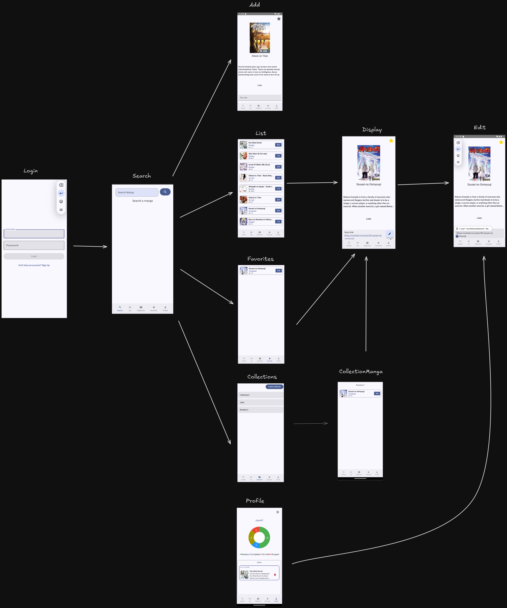
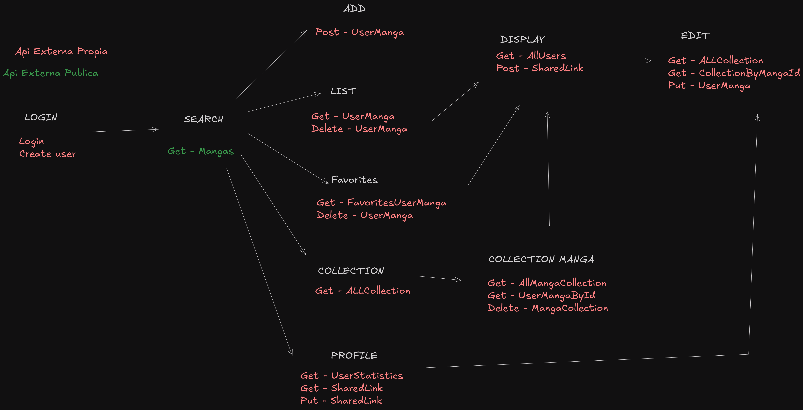

Manga Tracker
Objetivo: Desarrollar una plataforma que facilite el seguimiento y la organización de mangas, permitiendo a los usuarios gestionar su progreso de lectura, mantener un registro personalizado de los mangas, y compartir sus descubrimientos con otros. Además, ofrecer herramientas para clasificar, organizar y acceder fácilmente a su contenido de manga favorito.

Funciones más relevantes:

	- Agregar mangas que se estan leyendo, admnistrando sus estados
	
	- Almacenar información relevante sobre los mangas
	
	- Organizar mangas en colecciones y favoritos
	
	- Enviar a otros usuarios de la aplicación enlaces a mangas guardados
	
	- Ver estadísticas de mangas almacenados
	

<h1 style="text-align: center;">Diagrama Parte 1 (Relaciones componenetes)</h1>

<h1 style="text-align: center;">Diagrama Parte 2 (Relaciones componenetes a APIs externas)</h1>

<h1 style="text-align: center;">Codigo fuente api externa propia</h1>

<h3>Python: https://github.com/UB3721/PythonApiFinalMovil </h3>

<h1 style="text-align: center;">API externa publica utilizada</h1>

<h3>Mangadex: https://api.mangadex.org/docs/swagger.html </h3>

<h1> Manual de Uso de la Aplicación </h1>

Este manual proporciona una guía sobre cómo utilizar la aplicación, siguiendo las pantallas y flujos descritos en el diagrama.

Inicio de Sesión

En la pantalla de inicio de sesión, se debe ingresar el nombre de usuario y la contraseña en los campos correspondientes. Luego, se debe hacer clic en el botón de inicio de sesión para acceder a la aplicación. En caso de no contar con un usuario, se puede registrar.

Búsqueda de Contenidos

En la pantalla de búsqueda, se puede utilizar la barra de búsqueda para encontrar contenido por nombre. Al escribir el nombre del contenido y presionar el botón de búsqueda (ícono de lupa), la aplicación mostrará los resultados disponibles. Se puede seleccionar un resultado para ver más detalles sobre el contenido, para agregar es mediante un click largo.

Agregado de un Contenido
Se puede agregar los datos pertinentes al manga seleccionado para finalmente guardarlo.

Visualización de un Contenido

En la pantalla de visualización, se mostrarán los detalles específicos del manga seleccionado, como el título, la descripción y la información adicional, en esta pantalla no se pueden realizar cambios, para ello utilizar el botón flotante e ir a la pantalla de edición. 

Edición de un Contenido

En la pantalla de edición, se podrá modificar la información de seguimiento del manga, tales como los enlaces a los sitios donde se consumen, si es favorito, las colección a la que va a pertenecer (Si se tiene colecciones). Una vez realizados los cambios, se debe guardar la información para que se actualice correctamente.

Favoritos

La pantalla de favoritos mostrará todos los mangas que han sido añadidos a la lista de favoritos. En esta pantalla, es posible eliminar mangas de la lista total, no de los favoritos para ello editar el contenido, o seleccionarlos para obtener más detalles sobre cada uno.

Creación y Visualización de Colecciones

En la pantalla de colecciones, se podrá visualizar y administrar las colecciones de mangas. Se podrá crear una nueva colección o abrir una colección existente. Al seleccionar una colección específica, se mostrará un listado con los mangas incluidos en ella.

Perfil del Usuario

En la pantalla del perfil, se mostrarán estadísticas sobre la actividad del usuario en la aplicación. Esto incluirá una gráfica de progreso que indicará el estado de los mangas en las siguientes categorías: "Leyendo", "Completado", "En Pausa" y "Abandonado". También se mostrará una lista de mangas que han sido enviados al usuario, estos podrán ser agregados mediante un click largo.

Navegación General

La aplicación cuenta con un sistema de navegación basado en pestañas o botones ubicados en la parte inferior de la pantalla. Las pestañas disponibles son:

    - Home/Listado: Muestra el listado de mangas.
    
    - Buscar: Accede a la función de búsqueda.
    
    - Favoritos: Muestra los mangas favoritos del usuario.
    
    - Perfil: Muestra las estadísticas y actividad del usuario.
    
    - Colecciones: Permite gestionar las colecciones de mangas.
    
